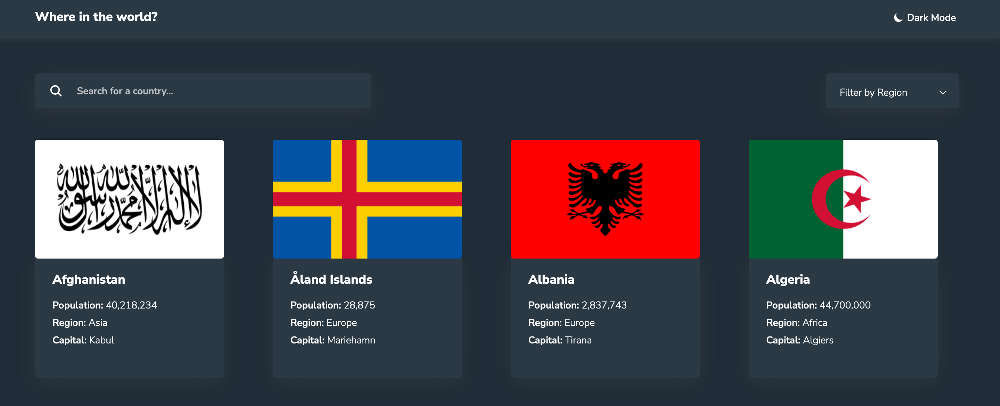

# Poject Title: REST Countries API with color theme switcher solution

This is a solution to the project objective which is to integrate with the REST Countries V2 API to pull country data and display it like in a design file that was sent to me. You are required to use the React + TypeScript front-end framework.

## Table of contents

- [Installing](#installing)
- [Overview](#overview)
  - [The challenge](#the-challenge)
  - [Screenshot](#screenshot)
  - [Links](#links)
- [My process](#my-process)
  - [Built with](#built-with)
  - [Tests](#tests)

## Installing

```bash
# Clone this repository
$ git clone https://github.com/CharlesBoaduAmalitech/rest-countries-api.git

# Installing all the dependencies
$ npm install

# Run the app
$ npm start
```

## Overview

### The challenge

Users should be able to:

- View the optimal layout for the site depending on their device's screen size
- See all countries from the API on the homepage
- Search for a country using an `input` field
- Filter countries by region
- Click on a country to see more detailed information on a separate page
- Click through to the border countries on the detail page
- Toggle the color scheme between light and dark mode.

### Screenshot



### Links

- Live Site URL : https://charlesboaduamalitec.github.io/rest-countries-api

## My process

### Built with

- React
- TypeScript
- React Router Dom
- REST Countries API
- React Query
- Axios
- Sass

### Tests

- Jest
- React Testing Library
- Mock Service Worker (MSW)
